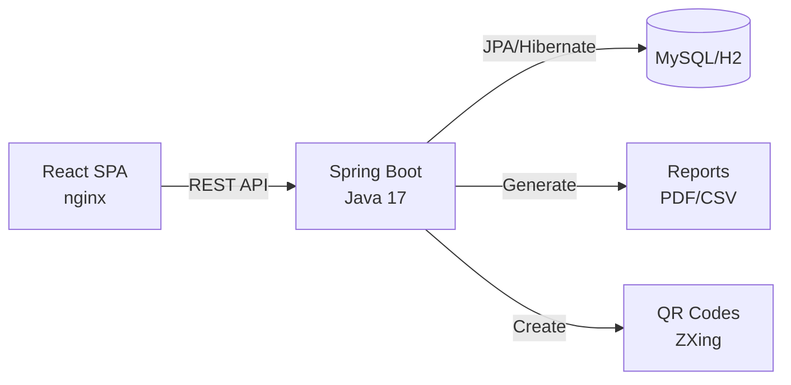

<div align="center">

# 🏥 MediWay Hospital Management System

[](https://www.oracle.com/java/)
[](https://spring.io/projects/spring-boot)
[](https://reactjs.org/)
[](https://www.mysql.com/)
[](https://www.docker.com/)

[](https://github.com/features/actions)
[](LICENSE)
[](CONTRIBUTING.md)

### *Modern full‑stack healthcare management platform providing appointment scheduling, patient records, administrative analytics, and secure role-based access.*

---

</div>

## 📋 Table of Contents
- [🎯 Project Overview](#-project-overview)
- [🔑 Key Capabilities](#-key-capabilities)
- [✨ Features](#-features)
- [🛠️ Tech Stack](#️-tech-stack)
- [📦 Prerequisites](#-prerequisites)
- [🚀 Installation & Setup](#-installation--setup)
- [🧪 Testing](#-testing)
- [🐳 Docker Deployment](#-docker-deployment)
- [⚙️ Configuration](#️-configuration)
- [🔄 CI/CD](#-cicd)
- [🛡️ Security](#️-security)

---

## 🎯 Project Overview
MediWay unifies patient, doctor and admin experiences into a single system:
- Streamlined appointment booking & availability management
- Secure medical record storage and retrieval
- Real-time reporting & operational insights
- Containerized deployment (Docker / Compose)
- CI workflow (GitHub Actions) with backend & frontend test automation + coverage

## 🔑 Key Capabilities
- **Appointment Management**: Intelligent slot validation prevents double booking (application-level conflict detection, extensible to optimistic locking)
- **Patient Records**: Complete visit & diagnosis history with controlled access
- **Administrative Dashboard**: Aggregated KPIs, doctor load, cancellations, specialization stats
- **Role-Based Security**: Distinct flows for patients, doctors, and admins (separate login paths)
- **Exportable Reports**: PDF & CSV generation (OpenPDF)
- **QR Code Integration**: Fast patient identification via ZXing

## ✨ Features
### 🏥 Appointment Scheduling System
- Doctor Availability & 30‑minute time slots
- Conflict Prevention: Checks existing appointments before persistence
- Status Lifecycle: `PENDING → CONFIRMED/REJECTED → CANCELLED`
- Reschedule & Cancellation endpoints
- Extensible for future concurrency strategies (optimistic/pessimistic locking)

### 👥 Patient Management
- Rich Profile Data: Core identity & emergency contacts
- Medical Records CRUD: Diagnoses, treatments, notes
- QR Code Generation for quick retrieval
- Secure Access Boundaries (service layer separation & profile scoping)

### 📊 Administrative Dashboard
- Workload Analytics: Appointments per doctor per day
- Demographics & Registration Trends
- Specialization & cancellation summaries
- Export: One‑click PDF or CSV downloads

## 🛠️ Tech Stack

<div align="center">

### Frontend


### Backend


### Database


### DevOps & Tools


### Libraries & Integration


</div>


---

### 🔄 Architecture Flow


---

## 📦 Prerequisites


- **Node.js** ≥ 18.x
- **Java 17** (Temurin recommended)
- **Docker Desktop** for container-based workflow
- **Maven** wrapper included (`./mvnw`)

---

## 🚀 Installation & Setup

### Quick Start (Recommended - Docker)

The fastest way to run the entire application:

```bash
# Clone the repository
git clone https://github.com/Y3S1-WE20/Medi.Way.git
cd Medi.Way

# Start all services with Docker Compose
docker-compose up --build

# Access the application
# Frontend: http://localhost:3000
# Backend API: http://localhost:8080
# MySQL: localhost:3306
```

### Manual Setup

#### 1. Clone
```bash
git clone https://github.com/Y3S1-WE20/Medi.Way.git
cd Medi.Way
```

#### 2. Frontend Setup
```bash
cd frontend
npm install
npm start   # http://localhost:3000
```

#### 3. Backend Setup
In another terminal:
```bash
cd backend
./mvnw spring-boot:run   # http://localhost:8080
```

> **Note:** Backend will use H2 in-memory database by default. For MySQL, configure `application.properties` or use Docker setup.
By default expects MySQL; for tests / light dev switch to H2 by exporting:
```bash
export SPRING_PROFILES_ACTIVE=test
```

---

## 🧪 Testing

### 🔧 Backend Testing
```bash
cd backend
./mvnw test
```
📊 Coverage report generated at `backend/target/site/jacoco/index.html`

### ⚛️ Frontend Testing
```bash
cd frontend
npm test -- --watchAll=false
```

---

## 🐳 Docker Deployment

### 🚀 Quick Start
Build & run all services (MySQL + backend + frontend):
```bash
docker compose up --build
```

### 🌐 Access Services
| Service | URL | Port |
|---------|-----|------|
| 🎨 Frontend | http://localhost:3000 | 3000 |
| ⚙️ Backend | http://localhost:8080 | 8080 |
| 🗄️ MySQL | localhost:3306 | 3306 |

### 🛑 Tear Down
```bash
docker compose down
```

### 🔄 Reset Database
```bash
docker compose down -v
```

---

## ⚙️ Configuration

| Variable | Purpose | Example |
|----------|---------|---------|
| 🔧 `SPRING_PROFILES_ACTIVE` | Choose profile (`test` uses H2) | `test` |
| 🗄️ `SPRING_DATASOURCE_URL` | JDBC URL when using MySQL | `jdbc:mysql://db:3306/mediway` |
| 🌐 `REACT_APP_API_BASE_URL` | Frontend build-time API base | `http://localhost:8080` |
| ☕ `JAVA_OPTS` | JVM tuning flags | `-Xms256m -Xmx512m` |

---

## 🔄 CI/CD


**Automated Pipeline includes:**
- ✅ Backend: Maven build + tests + JaCoCo coverage artifact
- ✅ Frontend: Install, lint (optional), tests, build artifact
- ✅ Combined summary job for status aggregation

---

## 🛡️ Security


**Security Features:**
- 🔐 Separate login routes for Admin, Doctor, and Patient
- 🔒 Password hashing via Spring Security Crypto
- 🎯 Role-based access control (RBAC)
- 🚀 Expandable for JWT/session authentication

---

<div align="center">

### 🌟 Made with ❤️ by the MediWay Team

[](https://github.com/Y3S1-WE20/Medi.Way/stargazers)
[](https://github.com/Y3S1-WE20/Medi.Way/network/members)

**If you find this project helpful, please consider giving it a ⭐!**

</div>
